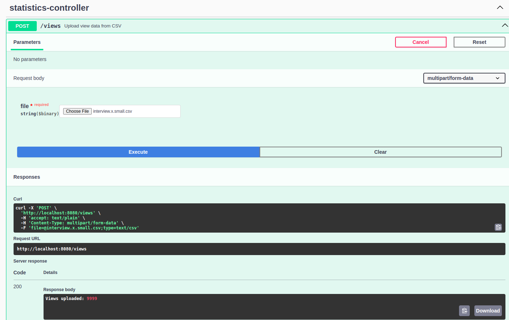
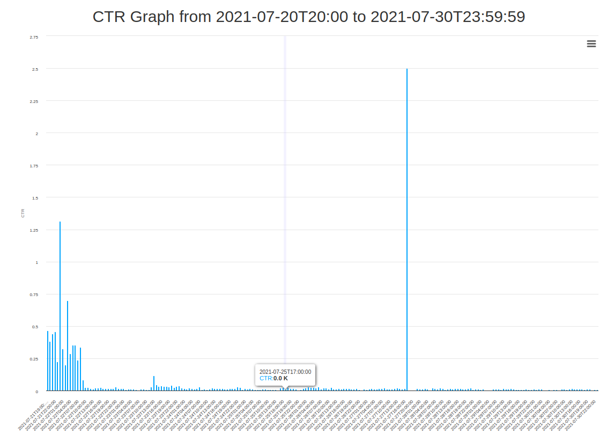

# CTR-EvPM
CTR &amp; EvPM Analysis &amp; Visualisation

This document provides an information about the API for the interaction between views and actions.

### 1. Upload Views from CSV

- **Endpoint:** `POST /views`
- **Summary:** This endpoint allows you to upload view data from a CSV file. The response includes the number of views successfully uploaded.

### 2. Upload Actions from CSV

- **Endpoint:** `POST /actions`
- **Summary:** Use this endpoint to upload action data from a CSV file. The response provides the number of actions successfully uploaded.

### 3. Calculate Number of Views for given mmDma and Dates

- **Endpoint:** `GET /views/allByMmDma`
- **Summary:** This endpoint calculates the number of views for a specified mmDma within a given date range.

### 4. Calculate Number of Views for given siteId and Dates

- **Endpoint:** `GET /views/allBySiteId`
- **Summary:** Calculate the number of views for a specified siteId within a given date range using this endpoint.

### 5. CTR for MmDma

- **Endpoint:** `GET /views/ctrByMmDma`
- **Summary:** Retrieve click-through rates (CTR) for MmDma with this endpoint.

### 6. CTR for MmDma with Tag

- **Endpoint:** `GET /views/ctrByMmDmaByTag`
- **Summary:** This endpoint retrieves CTR for MmDma with a specific tag.

### 7. CTR for SiteId

- **Endpoint:** `GET /views/ctrBySiteId`
- **Summary:** Obtain click-through rates (CTR) for SiteId using this endpoint.

### 8. CTR for SiteId with Tag

- **Endpoint:** `GET /views/ctrBySiteIdByTag`
- **Summary:** Retrieve CTR for SiteId with a specific tag through this endpoint.

# API Usage Examples

## Swagger example

1. **Launch the Application:**
    - Ensure that the application is up and running.
    - Navigate to [http://localhost:8080/](http://localhost:8080/) in your web browser.

2. **Explore the API with Swagger:**
    - Visit [http://localhost:8080/swagger-ui.html](http://localhost:8080/swagger-ui.html) for an interactive Swagger UI experience.
    - Browse available controller methods

3**Upload Views and Actions Files:**
    - Utilize the appropriate POST requests to upload view and actions files.
    - Refer to the specific API documentation for details on file uploads.

4**Test Endpoints:**
    - Click on specific endpoints to view details.
    - Use the "Try it out" button to test endpoints directly within Swagger UI.
    - Provide required parameters and execute requests to see real-time responses.


**Example Requests:**
- Upload Views File:


# Get Click-Through Rate (CTR) for MmDma within Date Range and Tag

## Description
This endpoint retrieves the Click-Through Rate (CTR) for a specified MmDma within a given date range.

## Endpoint
`GET /views/ctr-by-dates`

## Request Parameters
- **dateFrom** (required): The starting date and time of the date range. Format: 'yyyy-MM-ddTHH:mm:ss'
- **dateTo** (required): The ending date and time of the date range. Format: 'yyyy-MM-ddTHH:mm:ss'

## Responses
- **200 OK**
    - Description: Array of MmDma and CTR pairs with a specific tag.

## Example
```http
GET /views/ctr-by-dates?dateFrom=2021-07-20T20:00:00&dateTo=2021-07-30T23:59:59
```

